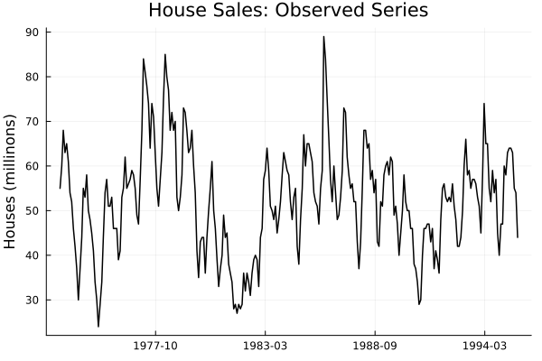
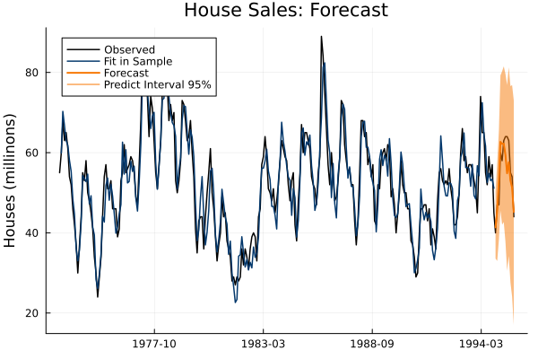

# UnobservedComponentsGAS

| *Build Status* | *Coverage* |
|:-----------------:|:-----------------:|
| [](https://github.com/LAMPSPUC/UnobservedComponentsGAS/actions/workflows/ci.yml) | [](https://codecov.io/gh/LAMPSPUC/UnobservedComponentsGAS) |

The UnobservedComponentsGAS.jl is an innovative open-source package developed entirely in Julia. This package facilitates the modeling of time series data by enabling users to define a diverse range of score-driven models with customizable parameter dynamics defined by unobserved components, akin to the State Space model. By representing these models as mathematical programming problems, this package leverages state-of-the-art optimization techniques and incorporates features from the field of optimization into the model formulation. This integration enhances predictive performance, incorporating robustness techniques for more reliable results.

## Table of contents:

- <a href="#score-driven-models-as-optimization-problems">Score-driven models as optimization problems</a>
- <a href="#implemented-dynamics">Implemented dynamics</a>
- <a href="#robustness-techniques">Robustness techniques</a>
  - <a href="#sample-robustness">Sample robustness</a>
  - <a href="#regularization">Regularization</a>
- <a href="#illustrative-example">Illustrative example</a>
- <a href="#next-steps">Next steps</a>
- <a href="#references">References</a>

## Score-driven models as optimization problems

As noted earlier, this package introduces a novel approach to model representation. The formulation of a score-driven model as an optimization problem is elegantly straightforward and relatively easy to grasp. Its core concept entails defining both fixed and time-varying parameters, along with components, as decision variables within the optimization framework. The temporal dynamics and any potential constraints on the fixed parameters' domain are enforced through constraints integrated into the problem's formulation. Lastly, an objective function is introduced to minimize the negative logarithm of the likelihood of the predictive distribution, a crucial step given that score-driven models are typically estimated using maximum likelihood estimation.

For enhanced clarity, let's denote $l(y_t;f_{t|t-1}, \theta)$ as the logarithm of the likelihood of a generic predictive distribution, where $f_t$ is a time-varying parameter and $\theta$ is a fixed parameter assumed to be positive. The local linear trend score-driven model can then be formulated as the following optimization problem:

$$
\begin{equation}
\begin{aligned}
\underset{\mathbf{f},\mathbf{m}, \mathbf{b}, \theta, \kappa_m, \kappa_b, \mathbf{s} }{\text{Min}} \quad & -\sum_{t=1}^Tl(y_t;f_{t|t-1}, \theta)\\
\text{s. t.} \quad & f_{t|t-1} = m_{t|t-1}, \quad & \forall t = 1,\cdots, T &&\\
& m_{t|t-1} = m_{t-1|t-2}  + b_{t-1|t-2} +  \kappa_m s_{t-1}, \quad &\forall t = 1,\cdots, T & \quad \quad \quad (1)&\\
& b_{t|t-1} = b_{t-1|t-2} + \kappa_b s_{t-1}, \quad & \forall t = 1,\cdots, T &&\\
& \theta > 0\\
& \kappa_m, \kappa_b \geq 0.
\end{aligned}
\end{equation}
$$

It is essential to emphasize that in the equation above, the scaled score $(s_t)$ is not a decision variable but rather a function of some variables. While the most precise representation of the scaled score could be $s_t(y_{t-1}, f_{t-1}, \theta, d)$, for the sake of simplicity in notation, we opt to use just $s_t$.

At this juncture, an important question arises: while the conceptual representation of the model as an optimization problem is straightforward, is the same true for its implementation? The answer to this question is "Yes," and the justification lies in one of the primary reasons for opting to develop this package using the Julia language.

In addition to providing a syntax that facilitates efficient development while maintaining computational performance, Julia offers a powerful toolset for tackling optimization challenges. [JuMP.jl](https://jump.dev/JuMP.jl/stable/),, an open-source modeling language, simplifies the formulation of various optimization problems, guiding the model to a designated solver and presenting results in a user-friendly format. It is crucial to highlight that JuMP acts as a bridge between user specifications and solvers. By selecting an appropriate solver, JuMP empowers users to handle diverse classes of optimization problems, including linear, mixed-integer, semidefinite, nonlinear, and more. The proposed package utilizes JuMP's modeling language to formulate various score-driven models as optimization problems, similar to what is demonstrated in Equation (1).

## Implemented dynamics

As mentioned earlier, UnobservedComponentsGAS.jl enables users to specify the dynamics of the time-varying parameters by exploring various formulations of the latent components. Below, we will outline the components that can be included and the different versions implemented for each of them.

- #### Trend:
  - Random Walk;
  - Random Walk + Slope;
  - AR(1);
  
- #### Seasonality
  - Stochastic seasonality via trigonometric terms;
  - Deterministic seasonality via trigonometric terms;
  
- #### Autoregressive 
- #### Explanatory variables

Given these components and the option to consider explanatory variables, the package facilitates the definition of various models, rendering it applicable across different scenarios.

## Robustness techniques
One of the primary advantages of formulating a model as a mathematical programming problem is the ability to integrate the model's formulations with various techniques from the optimization field. Among these techniques, robustness techniques emerge as an intriguing approach to enhance model performance. In this regard, this package enables the inclusion of two distinct robust techniques directly in the model formulation. These techniques will be briefly discussed below.

### Sample robustness

This feature builds upon the work of Bertsimas & Paskov (2020), who successfully enhanced the robustness of an AR(p) model against regime changes in the time series. These regime changes manifest as disruptions in the typical patterns of the series and can stem from events such as economic crises and pandemics, which typically significantly impact model performance. Therefore, possessing a model capable of performing satisfactorily even during these periods is highly relevant.

Before delving into discussing how this feature works, it is necessary to understand how a generic time series model can be expressed as an optimization problem. Equation (2) demonstrates this formulation.

$$
\begin{equation}
\begin{aligned}
\underset{\boldsymbol{\theta} \in \Theta}{\hbox{Min}} & \quad \sum_{t=1}^Tg(y_t, \boldsymbol{\theta}) & \quad \quad (2)&\\
% \text{s.t.} & \quad y_t = f(\mathbf{y}, \Theta) \quad \forall t = 1, \cdots, T, \
\end{aligned}
\end{equation}
$$

In this equation, $\boldsymbol{\theta}$ represents the vector of model parameters that can vary over time, while $g(y_t, \boldsymbol{\theta})$ denotes a generic loss function dependent on the time series observed $(y_t)$ and $\boldsymbol{\theta}$. It is essential to note that depending on the model, the set $\Theta$ can define constraints or describe the time-varying nature of parameters.

The primary concept behind this technique is to employ optimization to identify the worst sub-sample of the data according to certain criteria and then estimate the model to be robust against all potential worst sub-samples. In this context, the criterion used is the worst sub-sample of length $K$. The formulation of the robust model, based on the model presented in Equation (2), is provided below.

$$\begin{equation}
\begin{aligned}
\underset{\boldsymbol{\theta} \in \Theta}{\hbox{Min}}\quad &\underset{z_t}{\hbox{Max}}  \quad \sum_{t=1}^T z_t g(y_t, \boldsymbol{\theta})\\
&\text{s.t.}  \quad  \sum_{t=1}^T z_t = K, & \quad \quad (3)\\
 &\quad \quad 0 \leq z_t \leq 1, \quad \forall t = 1 \cdots T\
\end{aligned}
\end{equation}$$

The concept behind Equation (3) is to train the model using the observed values that maximize the error. In other words, for a given model with optimized parameters, the inner maximization problem selects the sub-sample that yields the highest error for this model. This selection is governed by the variable $z_t$, where $z_t = 1$ implies that $y_t$ will be included in the training set. Solving this problem produces a model trained on the most challenging training set according to a certain criterion, thereby enhancing robustness and stability during regime changes.

While this formulation clarifies the intuition behind this technique, it does not lend itself to an efficient resolution of the problem. To address this challenge, a series of manipulations involving duality must be undertaken in the problem depicted in Equation (3). Further details regarding these manipulations can be found in Bertsimas & Paskov (2020). Here, only the final formulation of the problem will be presented.

$$\begin{equation}
\begin{aligned}
\underset{\boldsymbol{\theta} \in \Theta, \delta \geq 0, u_t \geq 0}{\hbox{Min}} & \quad K \delta + \sum_{t=1}^Tu_t\\
\text{s.t.}& \quad \delta + u_t \geq g(y_t, \boldsymbol{\theta}) \quad &\forall t = 1, \cdots, T  \quad \quad (4)
\end{aligned}
\end{equation}$$

### Regularization

The $\kappa$ parameters play a pivotal role in score-driven model formulation by controlling the variability of the components. It is important to note that if $\kappa = 0$, the associated component becomes deterministic. Conversely, higher values of these parameters increase the uncertainty introduced to the model by the score term. Initial tests indicated that this increase in parameter estimates could significantly amplify the width of probabilistic forecast intervals, potentially impacting the model's performance. As a result, there is a need to restrict the magnitude of parameter estimates.

However, there is no consensus in the literature regarding an appropriate upper bound for the $\kappa$ parameters. To tackle this challenge, a regularization term is introduced into the objective function to penalize large values of $\kappa$. The rationale behind this inclusion is to encourage the model to favor smaller values for $\kappa$ while still allowing the estimation of higher values if they enhance the likelihood function. This feature enables control over the $\kappa$ values without imposing an arbitrary upper bound that may not be universally applicable.

Given that the objective here does not entail selecting which components should be treated as stochastic or deterministic, the regularization term adopts an $\ell_2$ norm. This choice ensures that none of the $\kappa$ parameters are estimated as exactly zero.

Despite the potential advantages of this feature, determining the penalty factor $\alpha$ poses a new challenge for users. Since $\alpha$ is defined as a non-negative constant, searching for the optimal value can be a complex and resource-intensive task. To narrow down the range of possible values for $\alpha$, this feature is incorporated into the model as a convex combination of the model's objective function and the penalty factor, as shown in Equation (5), where $\boldsymbol{\kappa}$ represents the vector of all $\kappa$ parameters of the model.

$$
\begin{equation}
\begin{aligned}
(1 - \alpha)(-\sum_{t=1}^Tl(y_t;f_{t|t-1}, \theta)) + \alpha \sum_j\boldsymbol{\kappa}_j^2  \quad \quad (5)
\end{aligned}
\end{equation}
$$

In this formulation, $\alpha \in [0, 1]$, where $\alpha = 0$ implies no regularization and $\alpha = 1$ indicates that only the penalty term is utilized in the objective function. This modification simplifies the process of tuning the $\alpha$ hyperparameter, as it operates within a well-defined interval.


It is important to highlight that both discussed robustness methodologies can be combined in the same model. This capability enables the definition of robust models across various aspects. To illustrate how both robustness features can be applied simultaneously, let's consider the model defined in Equation (1). Equation (6) illustrates the formulation of a model that simultaneously employs both the sample robustness method and regularization as a component variance controller.

$$
\begin{equation}
\begin{aligned}
\underset{\mathbf{f},\mathbf{m}, \mathbf{b}, \theta, \kappa_m, \kappa_b, \delta, \mathbf{u}}{\text{Min}} \quad & (1-\alpha)(K \delta + \sum_{t=1}^Tu_t) + \alpha(\kappa_m^2 + \kappa_b^2)\\
\text{s. t.} \quad & \delta + u_t \geq -l(y_t;f_{t|t-1}, \theta), \quad & \forall t = 1,\cdots, T & &\\
&f_{t|t-1} = m_{t|t-1}, \quad & \forall t = 1,\cdots, T& &\\
& m_{t|t-1} = m_{t-1|t-2}  + b_{t-1|t-2} +  \kappa_m s_{t-1}, \quad & \forall t = 1,\cdots, T & \quad \quad (6)\\
& b_{t|t-1} = b_{t-1|t-2} + \kappa_b s_{t-1}, \quad & \forall t = 1,\cdots, T & &\\
& \theta > 0\\
& \kappa_m, \kappa_b \geq 0.
\end{aligned}
\end{equation}
$$

## Illustrative Example

This section aims to illustrate how this package can be used for time series modeling. To accomplish this, the first step is to correctly install the package, which can be easily done by using the following code.

```julia
import Pkg;

Pkg.add("https://github.com/LAMPSPUC/UnobservedComponentsGAS.git")
```
To carry out this example, we will consider sales data for new single-family homes in the US. Let's assume the data can be loaded using the code below.

```julia
Pkg.add("CSV")
Pkg.add("DataFrames")

data = CSV.read("Data/hsales.csv", DataFrame)

y_train = data[1:end-12, 2]
y_val   = data[end-11:end, 2]

dates_train = data[1:end-12, 1]
dates_val   = data[end-11:end, 1]
```

Note that the preceding code also partitions the data into training and validation sets.



At this point, the next step is to define the model that will be estimated. The following code demonstrates how a score-driven model based on a t-LocationScale distribution, with only the mean parameter being time-varying, following a random walk plus a deterministic seasonality dynamic, can be implemented. Note that the scale parameter $d$ was defined to be equal to 1, and the sample robust technique was not applied.

```julia
dist = UnobservedComponentsGAS.tLocationScaleDistribution();

time_varying_params = [true, false, false];
d                   = 1.0;
level               = ["random walk", "", ""];
seasonality         = ["deterministic 12", "", ""];
ar                  = missing
sample_robustness   = false;

model = UnobservedComponentsGAS.GASModel(dist, time_varying_params, d, level, seasonality, ar)
```

Once specified, you can initiate the optimization process to actually estimate the model. This is accomplished using the *fit* function, which takes as arguments the previously defined model (GASModel object) and the estimation data. Furthermore, you'll notice the use of arguments $\alpha = 0.0$, indicating that the regularization method was not applied, and *initial_values* = missing, which means that the initialization process proposed by the package will be adopted.

```julia
fitted_model = UnobservedComponentsGAS.fit(model, y_train; α = 0.0, robust = sample_robustness, initial_values = missing);
```
After completing the model estimation process, you can access some of its results using the codes below. It is worth noting that these results should be used to evaluate the adequacy of the defined model, which is a crucial step in time series modeling.

```julia
fitted_model.fit_in_sample   
fitted_model.fitted_params
fitted_model.components["param_1"]["seasonality"] #access the seasonality component of the mean parameter
fitted_model.residuals
```
Finally, once the adequacy of the model has been checked, the last step involves using it to make predictions. The predict function handles this task and accepts arguments such as the defined and estimated model, training data, the number of steps forward for prediction, and the number of scenarios considered in the simulation. It is important to highlight that this function provides both point and probabilistic predictions, allowing users to specify the intervals of interest through their desired confidence level using the argument *probabilistic_intervals*.

```julia
steps_ahead    = 12;
num_scenarious = 500;

forec = UnobservedComponentsGAS.predict(model, fitted_model, y_train, steps_ahead, num_scenarious; probabilistic_intervals = [0.8, 0.95])
```



From the figure above, it is evident that the estimated model successfully captured the dynamics of the series during the training period and produced predictions, both point estimates and intervals, that closely align with the observed data.

## Next steps

- Broaden the range of available distributions, encompassing both continuous and discrete options.
- Expand the scope of covered dynamics, offering more possibilities.
- Enable the variation of effects from explanatory variables over time.
- Assess and incorporate new extensions associated with the field of optimization.

## References

- BERTSIMAS, D.; PASKOV, I. Time series that are robust to regime changes. **Journal of Machine Learning Research**, v. 21, p. 1–31, 2020.
